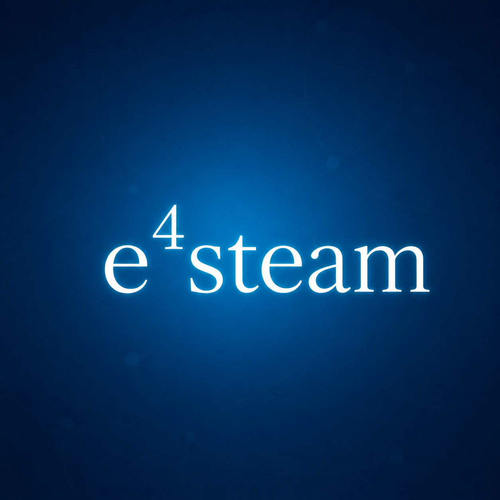

# e4steam

### Play Minecraft with friends through Steam

**English** · Русский ниже

e4steam lets you invite Steam friends directly into your Minecraft singleplayer world — without port forwarding, a public IP address, or router setup.

- Open a world to Steam friends or by invitation.
- Invite friends through the Steam overlay with **Shift + Tab**.
- Steam automatically uses a direct P2P connection or Valve relays.
- The connection closes automatically when you leave the world.

Both players need e4steam installed and must be signed in to Steam.

## How to play

1. Install e4steam on both computers and start Steam.
2. Open a singleplayer world and select **Open to LAN → Steam friends**.
3. Press **Invite friends**, send a Steam invitation, and play.

## Video demonstration

## Open a world

## Close the connection

## Download

[Download e4steam on CurseForge](https://www.curseforge.com/minecraft/mc-mods/e4steam)

The Modrinth page will be added after moderation.

<b>Русский — нажмите, чтобы открыть</b>

## Играйте с друзьями в Minecraft через Steam

e4steam позволяет приглашать друзей из Steam прямо в одиночный мир Minecraft — без проброса портов, белого IP и настройки роутера.

- Открывайте мир для друзей Steam или только по приглашению.
- Приглашайте друзей через оверлей Steam с помощью **Shift + Tab**.
- Steam автоматически использует прямое P2P-соединение или ретрансляторы Valve.
- После выхода из мира соединение закрывается автоматически.

Мод должен быть установлен у обоих игроков. Также оба игрока должны запустить Steam и войти в свои аккаунты.

### Как начать игру

1. Установите e4steam на оба компьютера и запустите Steam.
2. Откройте одиночный мир и выберите **Открыть для сети → Для друзей Steam**.
3. Нажмите **Пригласить друзей**, отправьте приглашение через Steam и играйте.

### Скачать

[Скачать e4steam на CurseForge](https://www.curseforge.com/minecraft/mc-mods/e4steam)

Ссылка на Modrinth будет добавлена после завершения модерации.

---

Created and maintained by **Kamilchik**. e4steam is an unofficial fork of the original [e4mc](https://github.com/vgskye/e4mc-minecraft-architectury) project and is distributed under the [MIT License](LICENSE). It is not affiliated with Valve, Mojang, or Microsoft.
